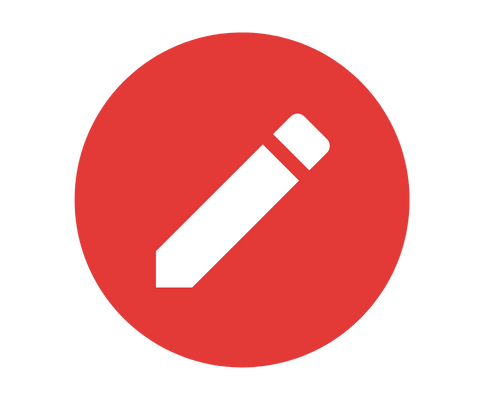
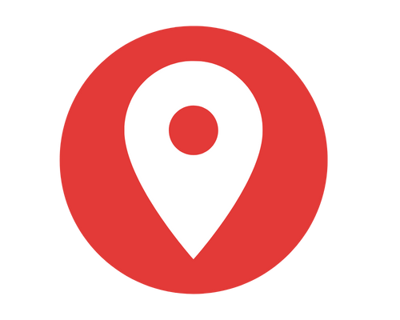

# Instruções de utilização

## Instalação do Site

O site em HTML/CSS/JS é um projeto estático, logo pode ser utilizado tanto em servidores...

## Histórico de versões

### [0.1.0] - 09/10/2022
#### Adicionado
- Adicionado ...

# Primeira versão da página de vidéos e atividade de fixação

```HTML


   <!DOCTYPE html>
   <html lang="pt-br">

    <head>
    <meta charset="UTF-8">
    <meta http-equiv="X-UA-Compatible" content="IE=edge">
    <meta name="viewport" content="width=device-width, initial-scale=1.0">
    <meta name="description" content="Save The Planet">
    <link rel="icon" type="image/x-icon" href="logo.png">
    <title>Save The Planet</title>
    <link rel="stylesheet" href="style.css">

</head>

<body>
    <!-- header section starts here-->
    <header class="header">
        <a href="#" class="logo">
            
        </a>

        <div id="Busca">
            <input type="text" id="txtBusca" placeholder="Buscar..." />
            <button id="btnBusca"></button>
        </div>

        <nav class="navbar">
            <a href="#home">home</a>
            <a href="about">sobre</a>
            <a href="contacts">contato</a>
        </nav>

    </header>

    <main>
        <section class="section">
            <h1>RECICLAR | CORES DAS LIXEIRAS | MEIO AMBIENTE | ENSINO FUNDAMENTAL | EDUCAÇÃO INFANTIL</h1>

            <div class="video">
                
                <iframe width="560" height="315" src="https://www.youtube.com/embed/6G6f2stDCN0"
                    title="RECICLAR | CORES DAS LIXEIRAS | MEIO AMBIENTE | ENSINO FUNDAMENTAL | EDUCAÇÃO INFANTIL"
                    frameborder="0"
                    allow="accelerometer; autoplay; clipboard-write; encrypted-media; gyroscope; picture-in-picture"
                    allowfullscreen></iframe>
            
            </div>

                <div class="atividade">
                    
                    <h1>Atividade de fixação</h1>
                    <h3>Escolha a alternativa correta</h3>

                </div>
                <div class="perguntas">
                    <div id="wrapper">
                        <div id="titulo"> </div>

                        <ul>
                            <li class="alternativa"></li>
                            <li class="alternativa"></li>
                            <li class="alternativa"></li>
                            <li class="alternativa"></li>
                        </ul>

                        <div id="result"></div>
                        <div id="pontos"></div>
                    </div>
            </section>
            <script type="text/javascript" src="script.js"></script>


            
        </footer>

    </main>
  

       

</html>
```

```CSS

  
    @import url('https://fonts.googleapis.com/css2?family=Montserrat:wght@300;600;800&display=swap');
    @import url('https://www.remessaonline.com.br/blog/tabela-de-cores-html-veja-os-codigos-para-aplicar-cores-nas-tags-html/');

    *{
    font-family: 'Montserrat', sans-serif;
    margin: 0;
    padding: 0;
    box-sizing: border-box;
    outline: none;
    border: none;
    text-decoration: capitalize;
    transition: 2s linear;
    }
  
    .header{
  
    background: var(--bg);
    display: flex;
    align-items: center;
    justify-content: space-between;
    padding: 1.5rem 7%;
    border-bottom: var(--border);
    top: 0; left: 0; right: 0;
    }
  
    .header .logo img{
    height: 3.5rem;
    }
  
    .header .navbar a{
    margin: 0 1rem;
    font-size: 20px;
    text-decoration: none;
    justify-content: space-between;
    font-weight: bold;
    color: rgb(8, 8, 8);
    }
  
    #Busca{
    background-color: #ffffff;
    border: solid 1px #114d23;
    border-radius: 5px;
    width: 300px;
    height: 32px;
    padding: right 100px;
    }
  
    #txtBusca{
    text-align: left;
    align-items: center;
    background-color: transparent;
    font-size: 15px;
    padding: 10px;
    border: none;
    height: 28px;
    width: 191px;
    }
  
    .section{
    position: absolute;
    top: 10%;
    width: 100%;
    text-align: center-left;
    padding: 60px;
    border: none;
    }
  
    .video{
    display: table;
    border: transparent thin solid;
    padding: 1px;
    width: 410px;
    height: 410px;
    position: fixed;
    float: right;
    }
  
    .atividade{
    display: table-cell;
    align-items: right;
    float: right;
    }
  
    #wrapper, .perguntas {
    margin-top: 40px;
    width: 100%;
    display: table-cell;
    flex-direction: column;
    align-items: center;
    float: right;
    width: 300px;
    margin-top: 5px;
    margin-left: 589px;
    }
  
    #wrapper div, #wrapper ul {
    width: 50%;
    max-width: 300px;
    display: table-cell;
    align-items: center;
    float: right;
    width: 300px;
    margin-top: 5px;
    }
  
    ul {
    padding: 0px;
    }

    #titulo {
    font-size: 18px;
    font-weight: bold;
    background: #32CD32;
    padding: 10px;
    width: 300px;
    max-width: 300px;
    text-align: center;
      
    }

    .alternativa {
    list-style-type: none;
    margin-bottom: 4px;
    padding: 10px;
    background: #32CD32;
    text-align-last: center;
    text-decoration-color: black;
   
    }

    .alternativa:hover {
    cursor: pointer;
    opacity: 0.8;
    background: black;
    
    }

    #result {
    font-weight: bold;
    width: 20px;
    max-width: 300px;
    
    }
 
    #pontos, #result {
    color: black;
    }

    .atividade{
 
    font-family: 'Georgia' !important;   
    font-size:20px;
    margin: 0 ;
    padding: 0 00%;
    font-weight: 0;
    text-align: center;
    font-display: center;
      
    
      
    }
```
    
    
    
```JAVA
    
    
   
    let perguntas = [

    { 
    titulo: 'Em qual lixeira devemos descartar os papeis ?',
    alternativas:['Amarelo', 'Azul', 'Vermelha', 'Verde'],
    correta: 1
    },
    { 
    titulo: 'Como devemos descartar o lixo que produzimos ?',
    alternativas:['Rua', 'Boeiro', 'Lixeira', 'Rios'],
    correta: 2
    },
    { 
    titulo: 'Em qual lixeira devemos descartar os vidros ?',
    alternativas:['Amarelo', 'Azul', 'Vermelha', 'Verde'],
    correta: 3
    },
    { 
    titulo: 'Em qual lixeira devemos descartar os metais ?',
    alternativas:['Amarelo', 'Azul', 'Vermelha', 'Verde'],
    correta: 0
    }
    ]
    let app= {
    start: function(){
    
    this.Atualpos = 0;
    this.Totalpontos = 0;
    
    let alts = document.querySelectorAll('.alternativa');
    alts.forEach((element, index)=>{
    element.addEventListener('click', ()=>{
    this.checaResposta(index);
    })
    })
    this.atualizaPontos();
    app.mostraquestao(perguntas[this.Atualpos]);
    },
    
    mostraquestao: function(q){
    this.qatual = q;
    // mostrando o titulo
    let titleDiv = document.getElementById('titulo');
    titleDiv.textContent = q.titulo;
    
    // mosrando as alternativas
    let alts = document.querySelectorAll('.alternativa');
    alts.forEach(function (element, index) {
    element.textContent = q.alternativas[index];
    });
    
    
    },
    
    Proximaperg: function(){
    this.Atualpos++;
    if(this.Atualpos == perguntas.length){
    this.Atualpos = 0;
    }
    },
    
    checaResposta: function(user){
    if(this.qatual.correta == user){
    console.log("Correta")
    this.Totalpontos++;
    this.mostraresposta();
    }
    else{
    console.log("Errada")
    this.mostraresposta();
    }
    this.atualizaPontos();
    this.Proximaperg();
    this.mostraquestao(perguntas[this.Atualpos]);
    },
    
    atualizaPontos: function(){
    let scoreDiv = document.getElementById('pontos');
    scoreDiv.textContent = `Sua pontuação é: ${this.Totalpontos}`;
    
    },
    
    mostraresposta: function(correta){

    let resultDiv = document.getElementById('result');
    let result = '';
    // formatar com a mensagem será exibida
    if(correta){
            
    result = 'Parabéns! Você acertou!';
    }
    else{
    // obtendo a questão atual
    let pergunta = perguntas[this.Atualpos];
    // obtenha o indice da resposta correta da questão atual
    let cindice = pergunta.correta;
    // obtenha o texto da resposta correta da questão atual
    let ctexto = pergunta.alternativas[cindice];
    result = `Resposta correta: ${ctexto}`;
    }
    resultDiv.textContent = result;
    
    }
    
    }
    app.start();
      
```
      
      
# Primeira versão da página de localização 
   
   
   
```html


   <!DOCTYPE html>
   html lang="pt-br">

<head>
    <meta charset="UTF-8">
    <meta http-equiv="X-UA-Compatible" content="IE=edge">
    <meta name="viewport" content="width=device-width, initial-scale=1.0">
    <meta name="description" content="Save The Planet">
    <link rel="icon" type="image/x-icon" href="logo.png">
    <title>Save The Planet</title>
    <link rel="stylesheet" href="localizacao.style.css">

</head>

<body>
    <!-- header section starts here-->
    <header class="header">
        <a href="#" class="logo">
            
        </a>

        <div id="Busca">
            <input type="text" id="txtBusca" placeholder="Buscar..." />
            <button id="btnBusca"></button>
        </div>

        <nav class="navbar">
            <a href="#home">home</a>

        </nav>


    </header>

    <main>


        <div class="localização">

            <h1>Veja aqui alguns pontos de coletas</h1><br>


        </div>

        <ul>
           
                <p><b>
                    <li class="Localização"> BH Recicla Reciclagem de Lixo Eletrônico e Outras Sucatas. - Endereço: Av.
                        General David Sarnoff, 2690 - Cidade Industrial, Contagem - MG, 32210-110
                        Áreas atendidas: Contagem e as proximidades <a href="https://bhrecicla.com.br/">Clique aqui.</a>
                    </li></p><br>
                     <p><b>

                   
                    <li class="Localização2"> URPV - Unidade de Recebimento de Pequenos Volumes - Liberdade -
                        Endereço:R. Flôr de Índio, 105 - Liberdade, Belo Horizonte - MG, 31270-215 <a
                            href="https://prefeitura.pbh.gov.br/slu/informacoes/servicos/urpvs-enderecos">Clique
                            aqui.</a></li><br>
                            
                    <li class="Localização3"> CMR - Reciclagem de Resíduos e Sucatas Ltda -
                        Endereço: R. Paracatu, 15 - Barro Preto, Belo Horizonte - MG, 30180-090
                        Áreas atendidas: Região Metropolitana de Belo Horizonte <a
                            href="https://cmrreciclagem.com.br/">Clique aqui.</a></li></p><br>
                            
                    <li class="Localização4"> Reciclagem Tc - 
                        Endereço: Av. Teresa Cristina - Betânia, Belo Horizonte - MG, 30662-537 <a href="https://www.reciclagemtc.com.br/">Clique aqui.</a></li></p><br>


                        <li class="Localização1"> BH Recicla Reciclagem de Lixo Eletrônico e Outras Sucatas -
                            Endereço: Av.General David Sarnoff, 2690 - Cidade Industrial, Contagem - MG, 32210-110
                            Áreas atendidas: Contagem e as proximidades <a href="https://bhrecicla.com.br/">Clique aqui.</a>
                        </li></p><br>
                        
                    </b>
        </ul>
    
    </main>


       
</html>
```

```css

    
     
    
    @import url('https://fonts.googleapis.com/css2?family=Montserrat:wght@300;600;800&display=swap');
    @import url('https://www.remessaonline.com.br/blog/tabela-de-cores-html-veja-os-codigos-para-aplicar-cores-nas-tags-html/');

    * {
    font-family: 'Montserrat', sans-serif;
    margin: 0;
    padding: 0;
    box-sizing: border-box;
    outline: none;
    border: none;
    text-decoration: capitalize;
    transition: 2s linear;
    
    }

    .header{
    background: var(--bg);
    display: flex;
    align-items: center;
    justify-content: space-between;
    padding: 1.5rem 7%;
    border-bottom: var(--border);
    top: 0; left: 0; right: 0;
    }

    .header .logo img{
    height: 3.5rem;
    }

    .header .navbar a{
    margin: 0 1rem;
    font-size: 20px;
    text-decoration: none;
    justify-content: space-between;
    font-weight: bold;
    color: rgb(8, 8, 8);
    }

    #Busca{
    background-color: #ffffff;
    border: solid 1px #114d23;
    border-radius: 5px;
    width: 300px;
    height: 32px;
    padding: right 100px;
    }
    #txtBusca{
    text-align: left;
    align-items: center;
    background-color: transparent;
    font-size: 15px;
    padding: 10px;
    border: none;
    height: 28px;
    width: 191px;

    }

    .localização> h1{
    display: flex;
    justify-content: space-between;
    align-items: center;
    top: 10%;
    width: 50%;
    padding: 60px;
    
   }
    .localização{
    margin-top: -1%;
   
   }
``` 

### [0.2.0] - 31/10/2022
#### Adicionado
# Segunda versão da página de localização

```html
   <!DOCTYPE html>
<html lang="pt-br">

<head>

    <head>
        <meta charset="UTF-8">
        <meta http-equiv="X-UA-Compatible" content="IE=edge">
        <meta name="viewport" content="width=device-width, initial-scale=1.0">
        <meta name="description" content="Save The Planet">
        <link rel="icon" type="image/x-icon" href="logo.png">
        <title>Save The Planet</title>
        <link rel="stylesheet" href="localizacao.style.css">


    </head>

<body>

 <!-- header section starts here-->
 <header class="header">
    <a href="#" class="logo">
        
    </a>

    <div id="Busca">
        <input type="text" id="txtBusca" placeholder="Buscar..." />
        <button id="btnBusca"></button>
    </div>

    <nav class="navbar">
        <a href="#home">home</a>

       
           
                
            
    </nav>

 
</header>
      


    <h1>Veja aqui alguns pontos de coletas</h1>
    
    <section>
        <div>

            <h3>URPV - Unidade de Recebimento de Pequenos Volumes - Liberdade</h3>
            <p>Endereço:R. Flôr de Índio, 105 - Liberdade, Belo Horizonte - MG
            <a href="https://prefeitura.pbh.gov.br/slu/informacoes/servicos/urpvs-enderecos" class="card-link">
                <button class="btn">Clique aqui.</button></a></p>

        </div>


        <div>

            <h3>CMR - Reciclagem de Resíduos e Sucatas Ltda</h3>
            <p>Endereço: R. Paracatu, 15 - Barro Preto, Belo Horizonte - MG
                <a href="https://cmrreciclagem.com.br/" class="card-link">
                    <button class="btn">Clique aqui.</button></a></p>

        </div>


        <div>

            <h3>Reciclagem Tc</h3>
            <p>Endereço: Av. Teresa Cristina - Betânia, Belo Horizonte - MG
                <a href="https://www.reciclagemtc.com.br/ " class="card-link">
                    <button class="btn">Clique aqui.</button></a>
            </p>
        </div>


        <div>
            <h3>BH Recicla Reciclagem de Lixo Eletrônico e Outras Sucatas</h3>
            <p>Endereço: Av.General David Sarnoff, 2690 - Cidade Industrial, Contagem - MG
              <a href="https://bhrecicla.com.br/"class="card-link">
                <button class="btn">Clique aqui.</button></a>
            </p>

        </div>
      
    </section>

    <body>

    </body>

</html>
```    
    
```css

    
     
     @import url('https://fonts.googleapis.com/css2?family=Montserrat:wght@300;600;800&display=swap');
     @import url('https://www.remessaonline.com.br/blog/tabela-de-cores-html-veja-os-codigos-para-aplicar-cores-nas-tags-html/');

* {
    font-family: 'Montserrat', sans-serif;
    box-sizing: border-box;
    outline: none;
    border: none;
    text-decoration: capitalize;
    transition: 2s linear;
}


.header{
    background: var(--bg);
    display: flex;
    align-items: center;
    justify-content: space-between;
    padding: 1.5rem 7%;
    border-bottom: var(--border);
    top: 0; left: 0; right: 0;
}

.header .logo img{
    height: 3.5rem;
}

.header .imagem{
    width: -20px;
    height: 3.5rem;
    float: left;
   
}


.header .navbar a{
    margin: 0 1rem;
    font-size: 20px;
    text-decoration: none;
    justify-content: space-between;
    font-weight: bold;
    color: rgb(8, 8, 8);
}

#Busca{
    background-color: #ffffff;
    border: solid 1px #114d23;
    border-radius: 5px;
    width: 300px;
    height: 32px;
    padding: right 100px;
}
#txtBusca{
    text-align: left;
    align-items: center;
    background-color: transparent;
    font-size: 15px;
    padding: 5px;
    border: none;
    height: 15px;
    width: 191px;
  

}
.imagem{
 display: flex;
 width: 50%;
 

   
}
body{
    margin: 0px;
    padding: 0px;
}


.mundo{
    display: none;
    width: 100%;

}
h1 {
margin-top: -4%;


}
h1{

    display: flex;
    justify-content: space-between;
    align-items: center;
    top: 10%;
    width: 50%;
    padding: 60px;
    color:black
}


div{
    display: inline-block;
    width: 35em;
    background-color: #9df09d;
    vertical-align: top;
    margin: 8px;
    padding: 10px;
    line-height: 100%;
    border: 1px solid #114d23;
    border-radius: 10px;
    box-sizing: border-box;
    text-align:left;
    justify-content: space-between;
}

.btn{
    border: none;
    padding: 5px;
    text-decoration: none;
    cursor: pointer;
    transition: background .3s;
    border-radius: 10px;
    box-sizing: border-box;
    border: 3px;
    float: right;
   margin: 10px;
}

.btn{
    background-color: #114d23;
    outline-color: none;
    color: aliceblue; 
}

.btn:hover{
background-color: #022702;

}.btn:active{
    color: #ffffff;
    background-color:#022702; ;
}
```  
    
 #Primeira versão da Home Page
 
 INDEX_HTML

```html


<!DOCTYPE html>
<html lang="pt-br">
<head>
    <meta charset="UTF-8">
    <meta http-equiv="X-UA-Compatible" content="IE=edge">
    <meta name="viewport" content="width=device-width, initial-scale=1.0">
    <title>Save The Planet</title>
    <link rel="stylesheet" href="style.css">
</head>
<body>
    <div id="header">
        <a href="#" class="logo">
            
        </a>

        <div id="busca">
            <input type="text" id="txtbusca" placeholder="Buscar...">
            <button id="btnbusca">Buscar</button>
        </div>

        <nav class="navbar">
            <a href="home">Home</a> 
        </nav>
    </div>


    <div id="container">
    <div class="texto">
        <h1>O MUNDO MUDA ATRAVÉS DA EDUCAÇÃO!</h1>
        <P>Lorem ipsum dolor sit amet, consectetur adipisicing elit. Adipisci ipsum iure iusto veritatis quae, quos nam, maiores laborum nihil aperiam explicabo totam voluptatibus quas molestias mollitia ducimus distinctio esse nemo. Lorem ipsum dolor sit amet consectetur, adipisicing elit. Suscipit ipsa maxime deserunt ratione praesentium dolorum, quia vel ad hic autem, porro quaerat temporibus voluptatum. Adipisci debitis repellendus ullam ea exercitationem?</P>
    </div>

    <div class="imagem">
        
        
    </div>
</div>

<div id="links">
    <div class="icon1">
        
    </div>

    <div class="icon2">
        
        
    </div>

    <div class="icon3">
        
    </div>
</div>

<div id="txticon">
    <div class="txticon1">
        <p>Lorem ipsum dolor sit amet, consectetur adipisicing elit. Provident, doloribus molestiae fugiat cum voluptates, illo doloremque animi illum voluptas mollitia earum consequuntur in voluptate soluta laborum quisquam dolor suscipit pariatur!</p>
    </div>

    <div class="txticon2">
        <p>Lorem ipsum dolor sit amet, consectetur adipisicing elit. Provident, doloribus molestiae fugiat cum voluptates, illo doloremque animi illum voluptas mollitia earum consequuntur in voluptate soluta laborum quisquam dolor suscipit pariatur!</p>
    </div>

    <div class="txticon3">
        <p>Lorem ipsum dolor sit amet, consectetur adipisicing elit. Provident, doloribus molestiae fugiat cum voluptates, illo doloremque animi illum voluptas mollitia earum consequuntur in voluptate soluta laborum quisquam dolor suscipit pariatur!</p>
    </div>
</div>


</body>
</html>


</html>
  
      
```


STYLE_CSS


```css

@import url('https://fonts.googleapis.com/css2?family=Montserrat:ital,wght@0,400;0,600;0,700;0,800;1,500&display=swap');


* {
    font-family: 'Monserrat', 'sans-serif'; 
}
#header {
    background: var(--bg);
    display: flex;
    align-items: center;
    justify-content: space-between;
    padding: 1.5rem 7%;
    border-bottom: var(--border);
    position: fixed;
    top: 0; left: 0; right: 0;
}

#header .logo img {
    height: 3.5rem;
}

#header .navbar a{
    margin: 0 1rem;
}

#header .navbar a{
    margin: 0 1rem;
    font-size: 20px;
    text-decoration: none;
    justify-content: space-between;
    font-weight: bold;
    color: rgb(8, 8, 8);

}

#busca {
    background-color: #ffff;
    border: solid 1px #114d23;
    border-radius: 5px;
    width: 300px;
    height: 32px;
    padding: right 100px;
}

#txtbusca {
    text-align: left;
    align-items: center;
    background-color: transparent;
    font-size: 15px;
    border: 10px;
    height: 28px;
    width: 191px;
    
}


#container {
    display: flex;
    justify-content: space-between;
    align-items: center;
}

#container {
    margin-top: 5%;
}

.texto {
    top: 10%;
    width: 50%;
    padding: 60px;
}

#links {
    display: flex;
    justify-content: space-around;
    margin-top: 5px
}

#links {
    background-color: #cce6d4;
}

#txticon {
    display: flex;
    justify-content: space-around;

}

#txticon {
    width: 100%;
    background-color: #cce6d4;
}


.txticon1 {
    padding: 0 5%;
}
.txticon2 {
    padding: 0 5%;
}
.txticon3 {
    padding: 0 5%;
}

#btnbusca {
    align-items: flex-end;
}

``` 
